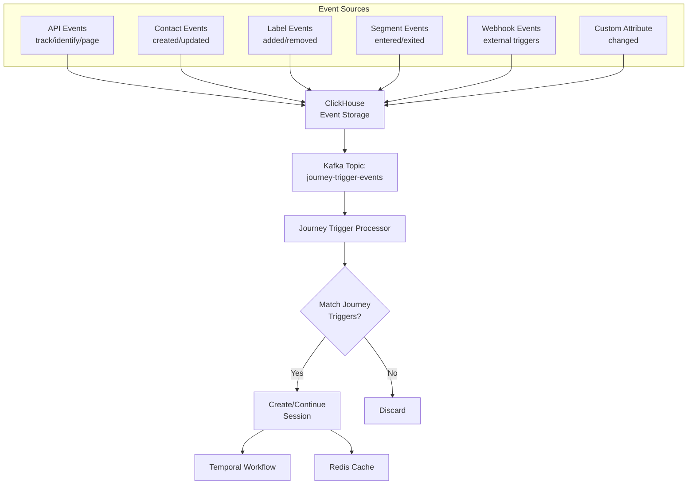

# Journey Execution Architecture - Temporal Implementation Plan

## 📋 Overview

Este documento detalha o planejamento para implementação do sistema de execução de jornadas usando **Temporal.io** no backend do **evo-campaign**. A arquitetura foi projetada para ser resiliente, observável e capaz de executar jornadas complexas com múltiplos nodes e condições.

## 🏛️ Unified Event-Driven Architecture

### **Sistema Unificado de Eventos como Triggers**

**Conceito Central**: TODOS os tipos de triggers são tratados como eventos no sistema, simplificando a arquitetura e permitindo processamento uniforme.

### **Fluxo de Eventos Unificado**


### **Event Types and Trigger Mapping**

| Trigger Type | Generated Event | Event Properties |
|-----------------|---------------|------------------------|
| **Manual** | `journey.manual_trigger` | `contactId`, `journeyId`, `triggeredBy` |
| **Event** | `{custom_event_name}` | `contactId`, `properties`, `timestamp` |
| **Segment** | `segment.entered` / `segment.exited` | `contactId`, `segmentId`, `action` |
| **Webhook** | `webhook.received` | `endpoint`, `data`, `headers` |
| **Contact Created** | `contact.created` | `contactId`, `traits`, `source` |
| **Contact Updated** | `contact.updated` | `contactId`, `changes`, `previousValues` |
| **Label** | `label.added` / `label.removed` | `contactId`, `labelId`, `labelName` |
| **Custom Attribute** | `attribute.changed` | `contactId`, `attributeName`, `value`, `previousValue` |

### **Unified Event Processing Implementation**

#### **1. ClickHouse to Kafka Pipeline (All Events)**
```sql
-- Option A: ClickHouse Kafka Engine to consume ALL events
CREATE TABLE evo_campaign.all_events_queue (
  messageId String,
  accountId String,
  contactId String,
  eventName String,
  eventType String,
  properties String,  -- JSON
  timestamp DateTime64(3)
) ENGINE = Kafka
SETTINGS 
  kafka_broker_list = 'kafka:9092',
  kafka_topic_list = 'all-events',  -- ALL events from the system
  kafka_group_name = 'journey-trigger-processor',
  kafka_format = 'JSONEachRow',
  kafka_num_consumers = 3;

-- Option B: Materialized View to push events to Kafka
-- This sends ALL events from contact_events table to Kafka for journey processing
CREATE TABLE evo_campaign.journey_trigger_kafka_queue (
  messageId String,
  accountId String,
  contactId String,
  eventName String,
  eventType String,
  properties String,
  timestamp DateTime64(3)
) ENGINE = Kafka
SETTINGS 
  kafka_broker_list = 'kafka:9092',
  kafka_topic_list = 'journey-trigger-events',
  kafka_format = 'JSONEachRow';

CREATE MATERIALIZED VIEW evo_campaign.events_to_journey_triggers_mv
TO evo_campaign.journey_trigger_kafka_queue
AS SELECT 
  messageId,
  accountId,
  contactId,
  eventName,
  eventType,
  properties,
  timestamp
FROM evo_campaign.contact_events
-- NO WHERE clause - send ALL events to be analyzed
-- The JourneyTriggerProcessor will decide what triggers what
```

#### **2. Webhook Endpoint for External Triggers**
```typescript
// POST /api/v1/journeys/trigger
@Post('trigger')
async triggerJourneyWebhook(@Body() payload: any, @Headers() headers: any) {
  const event = {
    messageId: uuidv4(),
    accountId: this.extractAccountId(headers),
    eventType: 'webhook',
    eventName: 'webhook.received',
    properties: {
      endpoint: '/api/v1/journeys/trigger',
      data: payload,
      headers: headers,
    },
    timestamp: new Date(),
  };
  
  // Send to ClickHouse for storage
  await this.clickhouseService.insertEvent(event);
  
  // Send to Kafka for processing
  await this.kafkaService.sendToTopic('journey-trigger-events', event);
  
  return { success: true, messageId: event.messageId };
}
```

#### **2. Automatic Event Generation from System Actions**
```typescript
// Contact Service - Generates events automatically
async createContact(data: CreateContactDto) {
  const contact = await this.repository.save(data);
  
  // Automatically generate contact.created event
  await this.eventService.emit({
    eventName: 'contact.created',
    contactId: contact.id,
    properties: { ...contact },
  });
  
  return contact;
}

async addLabel(contactId: string, labelId: string) {
  // Add label logic...
  
  // Automatically generate label.added event
  await this.eventService.emit({
    eventName: 'label.added',
    contactId,
    properties: { labelId, labelName },
  });
}
```

#### **3. Journey Trigger Processor Service**
```typescript
@Injectable()
export class JourneyTriggerProcessor {
  async processEvent(event: EventData) {
    // 1. Find all active journeys for this account
    const journeys = await this.journeyRepo.find({
      accountId: event.accountId,
      isActive: true,
    });
    
    // 2. Check each journey's trigger conditions
    for (const journey of journeys) {
      const triggerNode = this.findTriggerNode(journey.flowData);
      
      if (this.eventMatchesTrigger(event, triggerNode)) {
        // 3. Check if contact already has active session
        const existingSession = await this.findActiveSession(
          event.contactId, 
          journey.id
        );
        
        if (!existingSession) {
          // 4. Create new journey session
          await this.createJourneySession(event, journey);
        }
      }
    }
  }
  
  private eventMatchesTrigger(event: EventData, triggerNode: FlowNode): boolean {
    const triggerType = triggerNode.data.triggerType;
    const triggerConfig = triggerNode.data;
    
    switch (triggerType) {
      case 'event':
        return event.eventName === triggerConfig.eventName;
        
      case 'segment':
        return event.eventName === `segment.${triggerConfig.action}` &&
               event.properties.segmentId === triggerConfig.segmentId;
               
      case 'contactCreated':
        return event.eventName === 'contact.created' &&
               this.matchesFilters(event.properties, triggerConfig.filters);
               
      case 'label':
        return event.eventName === `label.${triggerConfig.action}` &&
               event.properties.labelId === triggerConfig.labelId;
               
      // ... other trigger types
    }
  }
}

### **Cache Strategy - Redis Primary, ClickHouse Analytics**
**Redis para Session Cache (Performance Only):**
- ✅ **Ultra-low latency** (<1ms) para session reads/writes  
- ✅ **In-memory performance** ideal para journey sessions ativas
- ✅ **Session TTL management** automático
- ✅ **Atomic operations** para concurrent session updates
- ✅ **Distributed locking** para safe concurrent updates

**ClickHouse para Analytics (When Needed):**
- ✅ **Historical analytics** de journey executions via API
- ✅ **Complex queries** para journey performance metrics
- ✅ **Data warehousing** para business intelligence  
- ✅ **Columnar storage** otimizado para agregações
- ✅ **On-demand statistics** sem overhead real-time

## 🏗️ Architecture Analysis

### Current Backend Architecture (evo-campaign)
- **Framework**: NestJS + TypeORM
- **Database**: PostgreSQL com JSONB para flow data
- **Event System**: Kafka + RabbitMQ para messaging
- **Authentication**: Auth0 JWT + API Keys
- **Multi-tenancy**: Account-based isolation
- **Existing Modules**: accounts, contacts, events, segments, labels, custom-attributes, journeys

### Frontend Journey System Analysis
- **13 Node Types**: Triggers (8), Actions (4), Control Flow (2), Timing (1), Data & Integration (2), Communication (1), Terminal (2)
- **Complex Features**: Variable mapping, conditional routing, A/B testing, multi-channel messaging, webhook integrations
- **State Management**: React Flow with real-time updates

## 🚀 Detailed Implementation Architecture

### **Event Processing Layer**

#### **Kafka/RabbitMQ Consumer Pattern**
```typescript
@Injectable()
export class JourneyTriggerConsumer implements OnModuleInit {
  constructor(
    private kafkaService: KafkaService,
    private journeySessionService: JourneySessionService,
    private journeyTriggerEvaluator: JourneyTriggerEvaluator,
    private temporalClient: TemporalClient,
  ) {}

  async onModuleInit() {
    // Subscribe to journey trigger events
    await this.kafkaService.createConsumer(async (payload) => {
      await this.processTriggerEvent(payload);
    }, 'journey-triggers');
  }

  private async processTriggerEvent(payload: EachMessagePayload) {
    const triggerEvent = JSON.parse(payload.message.value.toString());
    
    // Find matching journeys for this trigger
    const matchingJourneys = await this.journeyTriggerEvaluator
      .evaluateTrigger(triggerEvent);
    
    for (const journey of matchingJourneys) {
      // Create or update journey session
      await this.createJourneySession(triggerEvent, journey);
    }
  }
}
```

### **Redis Cache Architecture**

#### **Session Cache Structure (Performance Only)**
```typescript
interface CachedJourneySession {
  // Primary session data (Redis Hash)
  session: JourneySession;
  
  // Execution state (Redis Hash)
  executionState: {
    currentNode: FlowNode;
    nextNodes: string[];
    variables: Record<string, any>;
    lastExecutedAt: Date;
  };
  
  // Session metadata (Redis String with TTL)
  metadata: {
    isActive: boolean;
    ttl: number;
    lockOwner?: string; // For distributed locking
  };
}

// Redis Key Patterns - Simplified
enum RedisKeys {
  SESSION = 'journey:session:{sessionId}',
  SESSION_STATE = 'journey:state:{sessionId}', 
  ACTIVE_SESSIONS = 'journey:active:{accountId}',
  SESSION_LOCK = 'journey:lock:{sessionId}'
  // ❌ Removed: SESSION_PUBSUB (no real-time updates needed)
}
```

#### **Cache Service Implementation**
```typescript
@Injectable()
export class JourneySessionCacheService {
  constructor(
    @InjectRedis() private redis: Redis,
    private logger: Logger,
  ) {}

  // Ultra-fast session retrieval
  async getSession(sessionId: string): Promise<JourneySession | null> {
    const sessionData = await this.redis.hgetall(`journey:session:${sessionId}`);
    return sessionData ? JSON.parse(sessionData.data) : null;
  }

  // Atomic session updates with distributed locking
  async updateSession(
    sessionId: string, 
    updates: Partial<JourneySession>,
    lockTimeout = 5000
  ): Promise<void> {
    const lockKey = `journey:lock:${sessionId}`;
    const lockValue = uuidv4();
    
    // Acquire distributed lock
    const acquired = await this.redis.set(
      lockKey, 
      lockValue, 
      'PX', 
      lockTimeout, 
      'NX'
    );
    
    if (!acquired) {
      throw new Error(`Session ${sessionId} is locked by another process`);
    }
    
    try {
      // Update session data
      await this.redis.hset(
        `journey:session:${sessionId}`,
        'data', JSON.stringify({ ...await this.getSession(sessionId), ...updates }),
        'updatedAt', new Date().toISOString()
      );
      
      // ❌ Removed: Real-time pub/sub (not needed for journey execution)
      
    } finally {
      // Release lock
      await this.redis.del(lockKey);
    }
  }

  // TTL management for active sessions
  async extendSessionTTL(sessionId: string, ttlSeconds = 3600): Promise<void> {
    await this.redis.expire(`journey:session:${sessionId}`, ttlSeconds);
    await this.redis.expire(`journey:state:${sessionId}`, ttlSeconds);
  }

  // Bulk operations for performance
  async getActiveSessions(accountId: string): Promise<JourneySession[]> {
    const sessionIds = await this.redis.smembers(`journey:active:${accountId}`);
    if (!sessionIds.length) return [];
    
    // Bulk fetch sessions using pipeline
    const pipeline = this.redis.pipeline();
    sessionIds.forEach(id => {
      pipeline.hgetall(`journey:session:${id}`);
    });
    
    const results = await pipeline.exec();
    return results
      .filter(([err, data]) => !err && data)
      .map(([, data]) => JSON.parse((data as any).data));
  }
}
```

### **Core Implementation Strategy**

#### **Entity Workflow Pattern**
Cada contato terá uma **Journey Session** representada por um Temporal Workflow único:
- **Workflow ID**: `journey-session-{contactId}-{journeyId}-{timestamp}`
- **Entity State**: Mantém o estado do contato durante a jornada
- **Durabilidade**: Persiste automaticamente o progresso e estado
- **Cache Integration**: Estado ativo mantido em Redis para performance

#### **Enhanced Journey Session Architecture**
```typescript
interface JourneySession {
  // Core identifiers
  id: string;
  contactId: string;
  journeyId: string;
  accountId: string;
  
  // Execution state
  currentNodeId: string;
  nextNodeIds: string[];
  
  // Variable system integration
  variables: Record<string, any>;
  systemVariables: Record<string, any>; // From EnvironmentManager
  
  // Performance and observability
  metadata: {
    startedAt: Date;
    lastExecutionAt: Date;
    executionCount: number;
    totalDuration: number;
    errors: JourneyError[];
    nodeExecutionHistory: NodeExecution[];
  };
  
  // Status and control
  status: 'running' | 'paused' | 'completed' | 'failed' | 'cancelled';
  
  // Cache optimization
  cache: {
    lastCacheUpdate: Date;
    ttl: number;
    isLocked: boolean;
  };
}
```

## 🔄 Temporal-Based Execution Model

### **Primary Journey Workflow (Temporal Orchestration)**
```typescript
@WorkflowMethod()
async executeJourney(session: JourneySession): Promise<void> {
  // 1. Load journey definition from database
  const journey = await this.getJourney(session.journeyId);
  
  // 2. Execute nodes sequentially with Temporal reliability
  while (session.status === 'running') {
    // 3. Execute current node via Activity
    const result = await this.executeNode(session.currentNodeId, session);
    
    // 4. Update session state (Redis cache + PostgreSQL persistence)
    await this.updateSessionState(session, result);
    
    // 5. Handle routing and conditions
    session.currentNodeId = this.getNextNode(result, journey);
    
    // 6. Handle special cases (Wait nodes with Temporal timers)
    if (result.waitRequired) {
      await sleep(Duration.fromSeconds(result.waitDuration)); // Temporal sleep
    }
    
    // 7. Handle conditional routing
    if (result.conditionalRouting) {
      session.currentNodeId = await this.evaluateConditions(result.conditions, session);
    }
  }
  
  // 8. Journey completed - cleanup and analytics
  await this.completeJourney(session);
}
```

### **Node Activity Pattern (Business Logic Execution)**
Cada tipo de node é implementado como uma **Temporal Activity** separada:

```typescript
// Action Activities - Direct business operations
@ActivityMethod()
async processAddLabelNode(nodeData: AddLabelNodeData, session: JourneySession): Promise<NodeExecutionResult> {
  // 1. Execute business logic
  await this.contactService.addLabel(session.contactId, nodeData.labelId);
  
  // 2. Update session cache for performance
  await this.cacheService.updateSession(session.id, { 
    lastExecutedNode: nodeData.id,
    variables: { ...session.variables, labelAdded: nodeData.labelId }
  });
  
  // 3. Log execution to ClickHouse for analytics
  await this.analyticsService.logNodeExecution(session, nodeData, 'completed');
  
  return { success: true, nextNodeId: nodeData.nextNodeId };
}

@ActivityMethod() 
async processUpdateContactNode(nodeData: UpdateContactNodeData, session: JourneySession): Promise<NodeExecutionResult> {
  // Business logic execution
  await this.contactService.updateContact(session.contactId, nodeData.updates);
  
  // Cache update
  await this.cacheService.updateSession(session.id, { 
    variables: { ...session.variables, contactUpdated: true }
  });
  
  return { success: true, nextNodeId: nodeData.nextNodeId };
}

// Control Flow Activities - Decision making
@ActivityMethod()
async processConditionalNode(nodeData: ConditionalNodeData, session: JourneySession): Promise<NodeExecutionResult> {
  const contact = await this.contactService.getContact(session.contactId);
  
  // Evaluate conditions and determine path
  for (const condition of nodeData.conditions) {
    const result = await this.evaluateCondition(condition, contact, session);
    if (result) {
      return { success: true, nextNodeId: condition.pathId };
    }
  }
  
  // Default path
  return { success: true, nextNodeId: nodeData.defaultPath };
}

// Timing Activities - Temporal sleep integration
@ActivityMethod()
async processWaitNode(nodeData: WaitNodeData, session: JourneySession): Promise<NodeExecutionResult> {
  // Let Temporal handle the waiting (no polling needed)
  // This returns immediately, waiting happens in the Workflow
  return { 
    success: true, 
    nextNodeId: nodeData.nextNodeId,
    waitRequired: true,
    waitDuration: nodeData.waitTimeSeconds 
  };
}

// Communication Activities - External integrations
@ActivityMethod()
async processSendMessageNode(nodeData: SendMessageNodeData, session: JourneySession): Promise<NodeExecutionResult> {
  // Send message via appropriate channel
  const result = await this.messageService.sendMessage(
    session.contactId, 
    nodeData.message, 
    nodeData.channelType
  );
  
  // Update variables with message result
  await this.cacheService.updateSession(session.id, {
    variables: { ...session.variables, lastMessageId: result.messageId }
  });
  
  return { success: result.success, nextNodeId: nodeData.nextNodeId };
}

@ActivityMethod()
async processSendWebhookNode(nodeData: SendWebhookNodeData, session: JourneySession): Promise<NodeExecutionResult> {
  // Execute webhook with response mapping
  const response = await this.webhookService.executeWebhook(nodeData.url, nodeData.payload);
  
  // Map response data to variables
  const mappedVariables = await this.variableService.processResponseMapping(
    nodeData.responseMapping, 
    response.data
  );
  
  // Update session with mapped variables
  await this.cacheService.updateSession(session.id, {
    variables: { ...session.variables, ...mappedVariables }
  });
  
  return { success: true, nextNodeId: nodeData.nextNodeId };
}

interface NodeExecutionResult {
  success: boolean;
  nextNodeId: string;
  waitRequired?: boolean;
  waitDuration?: number;
  conditionalRouting?: boolean;
  conditions?: any[];
  error?: string;
  variables?: Record<string, any>;
}
```

### **Temporal Benefits for Journey Execution:**
- **Automatic Recovery**: Workflows restart from last checkpoint after crashes
- **State Persistence**: Journey progress never lost, handled by Temporal
- **Timer Management**: Wait nodes use Temporal sleep (no polling/cron needed)
- **Error Handling**: Built-in retry logic with exponential backoff
- **Observability**: Complete execution history in Temporal UI
- **Scalability**: Thousands of concurrent journey workflows

## 🎯 Implementation Phases

### **Phase 1: Core Infrastructure**
1. **Temporal Setup**
   - Docker Compose integration with Temporal server
   - Worker service configuration
   - Database schema for journey sessions

2. **Base Classes**
   ```typescript
   // Base Journey Workflow
   abstract class BaseJourneyWorkflow {
     protected session: JourneySession;
     protected journeyDefinition: Journey;
     
     abstract execute(): Promise<void>;
     
     protected async executeNode(nodeId: string): Promise<string | string[]>;
     protected async evaluateConditions(conditions: any[]): Promise<boolean>;
     protected async updateSessionState(updates: Partial<JourneySession>): Promise<void>;
   }
   
   // Base Node Activity
   abstract class BaseNodeActivity {
     abstract process(nodeData: any, session: JourneySession): Promise<NodeExecutionResult>;
   }
   ```

3. **Journey Session Service**
   ```typescript
   @Injectable()
   export class JourneySessionService {
     async createSession(contactId: string, journeyId: string): Promise<JourneySession>
     async updateSession(sessionId: string, updates: Partial<JourneySession>): Promise<void>
     async findSession(sessionId: string): Promise<JourneySession>
     async pauseSession(sessionId: string): Promise<void>
     async resumeSession(sessionId: string): Promise<void>
     async cancelSession(sessionId: string): Promise<void>
   }
   ```

### **Phase 2: Node Implementations**

#### **Trigger Node Processing**
```typescript
@Injectable()
export class TriggerNodeActivity extends BaseNodeActivity {
  async process(nodeData: TriggerNodeData, session: JourneySession): Promise<NodeExecutionResult> {
    switch(nodeData.triggerType) {
      case 'event':
        return await this.processEventTrigger(nodeData, session);
      case 'segment':  
        return await this.processSegmentTrigger(nodeData, session);
      case 'webhook':
        return await this.processWebhookTrigger(nodeData, session);
      // ... outros triggers
    }
  }
}
```

#### **Variable Management System**
```typescript
@Injectable() 
export class VariableService {
  async setVariable(session: JourneySession, key: string, value: any): Promise<void>
  async getVariable(session: JourneySession, key: string): Promise<any>
  async processVariableMapping(mapping: DataMapping[], sourceData: any): Promise<Record<string, any>>
  async resolveVariableReferences(text: string, session: JourneySession): Promise<string>
}
```

### **Phase 3: Advanced Features**

#### **Wait Node with Temporal Timers**
```typescript
@Injectable()
export class WaitNodeActivity extends BaseNodeActivity {
  async process(nodeData: WaitNodeData, session: JourneySession): Promise<NodeExecutionResult> {
    switch(nodeData.waitType) {
      case 'time':
        // Use Temporal sleep for time-based waits
        await sleep(Duration.fromHours(nodeData.hours));
        break;
      
      case 'event':
        // Use signals for event-based waits
        await this.waitForSignal(nodeData.eventName, nodeData.timeout);
        break;
      
      case 'condition':
        // Polling with exponential backoff
        await this.waitForCondition(nodeData.condition, session);
        break;
    }
  }
}
```

#### **Conditional Routing Logic**
```typescript
@Injectable()
export class ConditionalNodeActivity extends BaseNodeActivity {
  async process(nodeData: ConditionalNodeData, session: JourneySession): Promise<NodeExecutionResult> {
    const conditions = nodeData.conditions;
    const contact = await this.getContact(session.contactId);
    
    for (const condition of conditions) {
      const result = await this.evaluateCondition(condition, contact, session);
      if (result) {
        return { nextNodeId: condition.pathId, success: true };
      }
    }
    
    // Default path
    return { nextNodeId: nodeData.defaultPath, success: true };
  }
}
```

### **Phase 4: Monitoring & Observability**

#### **Journey Analytics Service**
```typescript
@Injectable()
export class JourneyAnalyticsService {
  async trackNodeExecution(sessionId: string, nodeId: string, duration: number): Promise<void>
  async trackJourneyCompletion(sessionId: string, completionType: 'success' | 'error' | 'cancelled'): Promise<void>
  async getJourneyMetrics(journeyId: string): Promise<JourneyMetrics>
  async getSessionHistory(sessionId: string): Promise<ExecutionEvent[]>
}
```

#### **Real-time Updates**
```typescript
@Injectable()
export class JourneyEventEmitter {
  @OnWorkflowSignal()
  async onNodeExecuted(sessionId: string, nodeId: string): Promise<void> {
    // Emit WebSocket event to frontend
    this.socketService.emit(`journey-session-${sessionId}`, {
      type: 'node_executed',
      nodeId,
      timestamp: new Date()
    });
  }
}
```

## 🔌 Integration Points

### **Enhanced Database Schema**
```sql
-- Journey Sessions Table (PostgreSQL for transactional data)
CREATE TABLE journey_sessions (
  id UUID PRIMARY KEY,
  contact_id UUID NOT NULL,
  journey_id UUID NOT NULL,  
  account_id UUID NOT NULL,
  workflow_id VARCHAR(500) NOT NULL UNIQUE, -- Temporal Workflow ID
  current_node_id VARCHAR(255),
  next_node_ids JSONB DEFAULT '[]',
  variables JSONB DEFAULT '{}',
  system_variables JSONB DEFAULT '{}',
  execution_metadata JSONB DEFAULT '{}',
  status VARCHAR(50) DEFAULT 'running',
  
  -- Cache optimization fields
  redis_ttl INTEGER DEFAULT 3600,
  last_cache_sync TIMESTAMP,
  is_cache_dirty BOOLEAN DEFAULT FALSE,
  
  -- Performance tracking
  total_execution_time_ms INTEGER DEFAULT 0,
  node_execution_count INTEGER DEFAULT 0,
  
  created_at TIMESTAMP DEFAULT NOW(),
  updated_at TIMESTAMP DEFAULT NOW(),
  
  -- Indexes for performance
  INDEX idx_journey_sessions_contact (contact_id),
  INDEX idx_journey_sessions_journey (journey_id),
  INDEX idx_journey_sessions_account (account_id),
  INDEX idx_journey_sessions_status (status),
  INDEX idx_journey_sessions_workflow (workflow_id)
);

-- Node Execution History Table (ClickHouse for analytics)
-- This will be created in ClickHouse for high-performance analytics
CREATE TABLE journey_node_executions (
  id UUID,
  session_id UUID,
  account_id UUID,
  journey_id UUID,
  contact_id UUID,
  node_id String,
  node_type String,
  execution_order UInt32,
  
  -- Execution details
  started_at DateTime64(3),
  completed_at DateTime64(3),
  duration_ms UInt32,
  success UInt8,
  retry_count UInt8,
  
  -- Data
  input_variables String, -- JSON string
  output_variables String, -- JSON string
  error_message Nullable(String),
  
  -- Performance metrics
  memory_usage_mb Nullable(Float32),
  cpu_time_ms Nullable(UInt32)
) ENGINE = MergeTree()
PARTITION BY toYYYYMM(started_at)
ORDER BY (account_id, journey_id, session_id, started_at);

-- Journey Trigger Events Table (ClickHouse for event streaming)
CREATE TABLE journey_trigger_events (
  id UUID,
  account_id UUID,
  trigger_type String,
  event_name Nullable(String),
  contact_id Nullable(UUID),
  
  -- Event data
  event_data String, -- JSON string
  event_timestamp DateTime64(3),
  processed_at DateTime64(3),
  
  -- Matching results
  matched_journeys Array(UUID),
  sessions_created Array(UUID),
  processing_duration_ms UInt32
) ENGINE = MergeTree()
PARTITION BY toYYYYMM(event_timestamp)
ORDER BY (account_id, trigger_type, event_timestamp);
```

### **Kafka Topic Architecture**
```typescript
// Kafka Topics Configuration
export enum KafkaTopics {
  // Trigger events from various sources
  JOURNEY_TRIGGERS = 'journey-triggers',
  
  // Contact events (from CRM integrations)
  CONTACT_EVENTS = 'contact-events',
  
  // Custom events (from track API)
  CUSTOM_EVENTS = 'custom-events',
  
  // Webhook events
  WEBHOOK_EVENTS = 'webhook-events',
  
  // Journey execution events
  JOURNEY_EXECUTIONS = 'journey-executions',
  
  // Analytics events for ClickHouse
  JOURNEY_ANALYTICS = 'journey-analytics',
}

// Kafka Message Schemas
interface JourneyTriggerMessage {
  eventId: string;
  accountId: string;
  triggerType: TriggerType;
  contactId?: string;
  eventData: Record<string, any>;
  timestamp: Date;
  
  // For webhook triggers
  webhookData?: {
    url: string;
    method: string;
    headers: Record<string, string>;
    body: any;
  };
  
  // For event triggers  
  eventName?: string;
  eventProperties?: Record<string, any>;
}

interface JourneyExecutionMessage {
  sessionId: string;
  accountId: string;
  journeyId: string;
  contactId: string;
  nodeId: string;
  nodeType: string;
  executionType: 'started' | 'completed' | 'failed' | 'retried';
  timestamp: Date;
  duration?: number;
  error?: string;
  variables?: Record<string, any>;
}
```

### **API Endpoints (Statistics On-Demand)**
```typescript
@Controller('journeys/:journeyId/sessions')
export class JourneySessionController {
  @Post('start')
  async startJourneySession(@Param('journeyId') journeyId: string, @Body() body: StartSessionDto)
  
  @Get(':sessionId')
  async getJourneySession(@Param('sessionId') sessionId: string)
  
  @Put(':sessionId/pause')
  async pauseJourneySession(@Param('sessionId') sessionId: string)
  
  @Put(':sessionId/resume') 
  async resumeJourneySession(@Param('sessionId') sessionId: string)
  
  @Delete(':sessionId')
  async cancelJourneySession(@Param('sessionId') sessionId: string)
  
  // ✅ On-demand statistics (no real-time overhead)
  @Get(':sessionId/history')
  async getExecutionHistory(@Param('sessionId') sessionId: string)
  
  @Get(':sessionId/current-status')
  async getCurrentStatus(@Param('sessionId') sessionId: string)
}

@Controller('journeys/:journeyId/analytics')
export class JourneyAnalyticsController {
  // ✅ Statistics via API when needed
  @Get('stats')
  async getJourneyStats(@Param('journeyId') journeyId: string)
  
  @Get('performance-metrics')
  async getPerformanceMetrics(@Param('journeyId') journeyId: string)
  
  @Get('completion-rates')
  async getCompletionRates(@Param('journeyId') journeyId: string)
}
```

## 🚀 Deployment & Scaling

### **Docker Compose Integration**
```yaml
# docker-compose.yml addition
services:
  temporal:
    image: temporalio/auto-setup:1.20.0
    ports:
      - "7233:7233"
    environment:
      - DB=postgresql
      - DB_PORT=5432
      - POSTGRES_USER=postgres
      - POSTGRES_PWD=password
      - POSTGRES_SEEDS=temporal
    depends_on:
      - postgres

  temporal-ui:
    image: temporalio/ui:2.18.0
    ports:
      - "8080:8080" 
    environment:
      - TEMPORAL_ADDRESS=temporal:7233
    depends_on:
      - temporal

  campaign-backend:
    # ... existing config
    environment:
      - TEMPORAL_ADDRESS=temporal:7233
    depends_on:
      - temporal
```

### **Scaling Strategy**
- **Horizontal Scaling**: Multiple worker instances processando diferentes journey sessions
- **Load Balancing**: Distribuição de sessions por account/region
- **Resource Limits**: Configuração de memory/CPU per workflow execution
- **Monitoring**: Temporal UI + custom metrics para observabilidade

## 🔍 Benefits & Advantages

### **Reliability**
- **Automatic Recovery**: Workflows reiniciam automaticamente após falhas
- **State Persistence**: Progresso nunca é perdido
- **Error Handling**: Retry policies configuraveis por node type

### **Observability** 
- **Complete History**: Cada execution step é registrado
- **Real-time Monitoring**: Temporal UI + custom dashboards
- **Debug Capabilities**: Replay de workflows para debugging

### **Business Alignment**
- **Process-Driven**: Arquitetura alinhada com business processes
- **Easy Evolution**: Adicionar novos node types sem breaking changes
- **A/B Testing**: Built-in support para experiments e feature flags

### **Performance**
- **Concurrent Execution**: Milhares de journey sessions simultaneas
- **Resource Efficiency**: State management otimizado pelo Temporal
- **Scalable Architecture**: Entity workflow pattern escala horizontalmente

### **Performance Comparison: Redis vs ClickHouse**

| Metric | Redis (Session Cache) | ClickHouse (Analytics) | Recomendação |
|--------|----------------------|------------------------|---------------|
| **Latency** | <1ms (in-memory) | 10-100ms (disk-based) | ✅ Redis para sessions ativas |
| **Throughput** | 100K+ ops/sec | 1M+ rows/sec insert | ✅ Ambos excelentes |
| **Concurrency** | Atomic operations | Columnar compression | ✅ Redis para concurrent updates |
| **Persistence** | Optional (RDB/AOF) | Built-in durability | ✅ ClickHouse para dados históricos |
| **Query Capability** | Simple key-value | Complex SQL analytics | ✅ ClickHouse para reporting |
| **Memory Usage** | High (all in RAM) | Efficient compression | ✅ Híbrido: Redis + ClickHouse |

## 📊 Enhanced Success Metrics

### **Performance KPIs**
- **Session Cache Performance**:
  - Session retrieval latency < 1ms (Redis)
  - Cache hit rate > 95%
  - Concurrent session updates > 10,000/sec
  - Redis memory usage < 80% capacity

- **Analytics Performance**:
  - Query response time < 100ms (90th percentile)
  - Data ingestion rate > 100K events/sec
  - ClickHouse compression ratio > 10:1
  - Historical data retention: 2 years

### **Reliability KPIs**
- Journey execution success rate > 99.9%
- Average node execution time < 100ms
- Recovery time from failures < 10 seconds
- Message processing lag < 1 second

### **Scalability KPIs**
- Concurrent active sessions > 50,000
- Horizontal scaling factor: 10x
- Auto-scaling response time < 30 seconds
- Cross-region replication lag < 5 seconds

### **Business KPIs**  
- Journey completion rates by type/segment
- Customer engagement score improvements
- A/B test statistical significance > 95%
- Time-to-market for new journey types < 1 week
- Real-time personalization response rate

## 🚀 Implementation Roadmap

### **Phase 1: Foundation (Weeks 1-2)**
1. **Infrastructure Setup**:
   - Temporal server deployment with Docker Compose
   - Redis configuration for session caching
   - Kafka topic: `journey-trigger-events`
   - Database schema for journey_sessions table

2. **Unified Event System**:
   - Journey webhook endpoint (`POST /api/v1/journeys/trigger`)
   - Event standardization layer (all triggers as events)
   - JourneyTriggerProcessor service (matches events to journeys)
   - Integration with existing ClickHouse event storage

### **Phase 2: Core Execution (Weeks 3-4)**
3. **Temporal Integration**:
   - Base JourneyWorkflow class
   - JourneySession entity implementation
   - Temporal worker service setup
   - Session lifecycle management (create, pause, resume, cancel)

4. **Basic Node Activities**:
   - Action nodes: AddLabel, RemoveLabel, UpdateContact
   - Variable management: SetVariable activity
   - Simple linear flow execution
   - Redis session caching for performance

### **Phase 3: Advanced Features (Weeks 5-7)**
5. **Flow Control Nodes**:
   - Conditional node with multi-path routing
   - Split node for A/B testing
   - Wait node (time, event, condition)
   - Exit and Transfer journey nodes

6. **Communication Nodes**:
   - Send Message (multi-channel)
   - Send Webhook with response mapping
   - Variable mapping system
   - Error handling and retries

### **Phase 4: Production Ready (Weeks 8-10)**
7. **Monitoring & Observability**:
   - Temporal UI integration
   - Custom metrics and alerts
   - Performance monitoring
   - Error tracking and reporting

8. **Performance & Scale**:
   - Load testing with 10K+ concurrent sessions
   - Memory optimization
   - Query performance tuning
   - Auto-scaling configuration

### **Phase 5: Advanced Integration (Weeks 11-12)**
9. **External Integrations**:
   - CRM system connectors
   - Email/SMS provider integrations
   - Webhook endpoint management
   - API rate limiting and retry logic

10. **Business Intelligence**:
    - Advanced journey analytics
    - Customer lifetime value tracking
    - Conversion funnel analysis
    - Predictive modeling integration

## 🎯 Key Architectural Decisions

### **Why Kafka for Triggers?**
- **Durability**: Events não são perdidos mesmo com falhas
- **Scalability**: Partitioning permite processamento paralelo
- **Integration**: Já usado no sistema existente
- **Replay**: Capacidade de reprocessar eventos históricos

### **Why Redis for Session Cache?**
- **Performance**: Sub-millisecond latency para session access
- **Atomicity**: Operations are atomic, preventing race conditions
- **Simple & Fast**: Sem overhead de pub/sub desnecessário
- **TTL**: Automatic cleanup de sessions inativas

### **Why ClickHouse for Analytics?**
- **Performance**: Queries analíticas 100x mais rápidas que PostgreSQL
- **Compression**: Armazenamento eficiente para dados históricos
- **Scalability**: Horizontal scaling para big data analytics
- **SQL Compatibility**: Queries familiares para business analysts

### **Why Temporal for Orchestration?**
- **Reliability**: Automatic recovery e state persistence
- **Observability**: Complete execution history e debugging
- **Scalability**: Handle milhões de workflow instances
- **Developer Experience**: Code as configuration, easy to understand

Esta arquitetura detalhada fornece uma solução enterprise-grade para journey execution, combinando performance ultra-alta com observabilidade completa e scalability horizontal necessária para sistemas de customer engagement em larga escala.